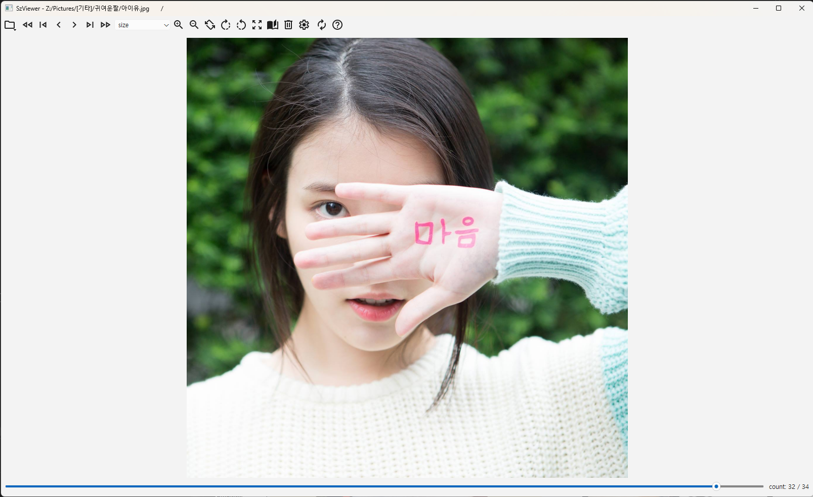
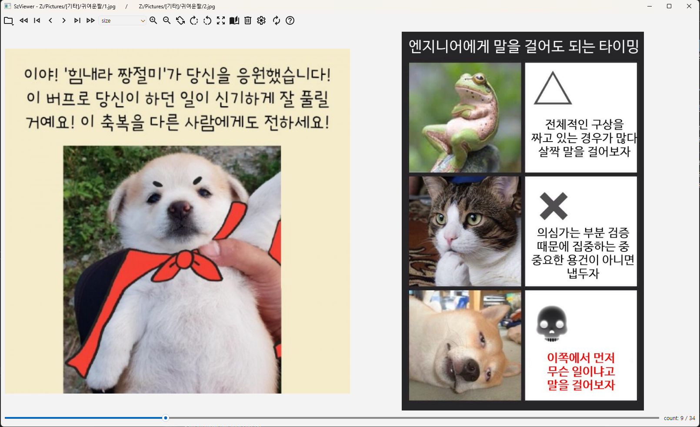
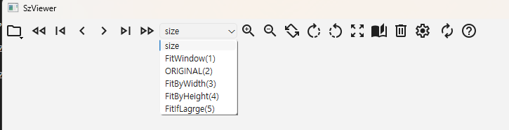
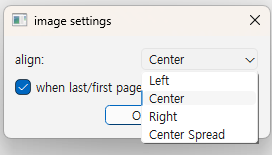
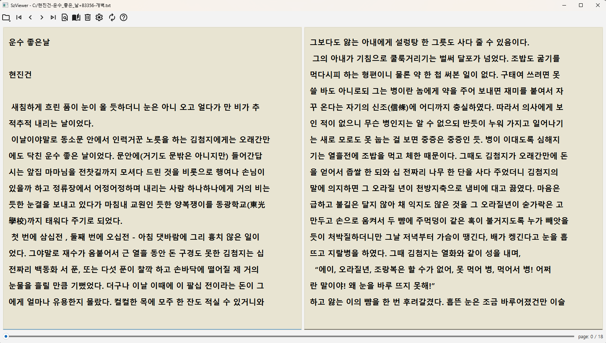
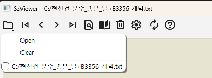

# SzViewer

## 텍스트뷰어 프로그램 0.2.0

### 이미지 뷰어

**- 이미지 뷰어 단축키**

- ←, → : 이전/다음 파일  
- PgUp, PgDn : 이전/다음 폴더  
- 1 : 윈도우 맞춤  
- 2 : 원본 크기  
- 3 : 가로 맞춤  
- 4 : 세로 맞춤  
- 5 : 이미지가 클때만 맞춤
- + : 확대  
- - : 축소  
- f : 전체화면
- esc : 전체화면 일때 해제
- del : 파일 삭제
- F2 : 파일 이름 변경
- F3 : 분할 보기 파일 이름 변경
- CTRL + F2 : 폴더 이름 변경
- *.jpg, *.jpeg, *.png, *.bmp, *.gif, *.webp , *.ico 등 지원합니다.  

**- 이미지 뷰어 툴바 설명**

좌측 부터 순서대로

- 파일열기/열었던 파일 히스토리(및 파일 고정) 메뉴
- 이전 폴더
- 첫 파일
- 이전 파일
- 다음 파일
- 마지막 파일
- 다음 폴더
- 사이즈 (윈도우에 맞춤, 원본, 가로 맞춤, 세로 맞춤, 이미지가 클때만 맞춤))
- 확대(10%)
- 축소(10%)
- 좌우반전
- -45도 회전
- +45도 회전
- 전체화면
- 두페이지 보기/한페이지 보기
- 파일/폴더 삭제
- 이미지 셋팅

	align : 이미지 정렬 (좌, 가운데, 우, spred(2페이지 보기일때만 몰아보기)

	checkbox (when last~~) : 마지막/첫 페이지일때 다음 폴더 / 이전 폴더로 이동.

- 텍스트 뷰어 전환
- about

### 텍스트 뷰어

**- 텍스트 뷰어 단축키**  
- ←, → : 페이지 좌우 이동  
- PgUp, PgDn : 폴더 내 다음 파일, 이전 파일  
- del : 파일 삭제
- 현재 *.txt (UTF-8)만 지원합니다.

**- 이미지 뷰어 툴바 설명**

좌측 부터 순서대로

- 파일열기/열었던 파일 히스토리(및 파일 고정) 메뉴
- 이전 파일
- 이전 페이지
- 다음 페이지
- 다음 파일
- 텍스트 검색 다이얼로그
- 두페이지 보기/한페이지 보기
- 파일/폴더 삭제
- 텍스트 셋팅
- 텍스트 뷰어 전환
- about